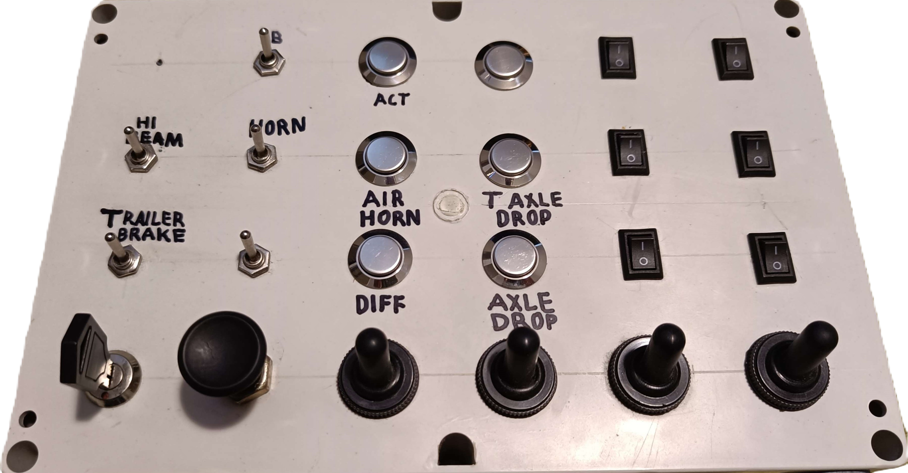

# ButtonBox
A small sketch I made for my friend's custom button box, which uses a [Teensy®++ 2.0 Development Board](https://www.pjrc.com/store/teensypp.html).

# Compiling
- [Arduino IDE](https://www.arduino.cc/en/software)
- [Teensyduino](https://www.pjrc.com/teensy/teensyduino.html)
